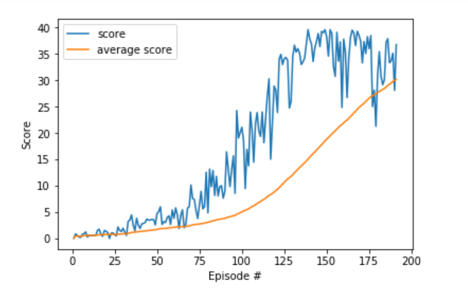

# Project Report

## Learning Algorithm 
Deep Deterministic Policy Gradient(DDPG) algorithm uses four neural networks: a Q network, a deterministic policy network, a target Q network, and a target policy network to solve continuous control problem.

- Target network. The target network is a time-delayed copy of its original network, which slowly tracks the learned network. Using these target value networks greatly improves the stability of learning. The method without using the target network, the update equation of the network depends on the value calculated by the network itself, which makes it easy to divergence. And use the soft update method with a very tiny parameter, we can imporve the stability of learning greatly.

- Replay buffer. As used in Deep Q learning, DDPG also uses a replay buffer to sample experiences to update neural network parameters. During each trajectory, we will save all experience tuples (state, action, reward, next_state, done) and store them in a limited size replay buffer. Then, when we update the value and policy network, we will randomly sample a small batch of experience from the replay buffer.

- Ornstein-Uhlenbeck process. In discrete action spaces, exploration is accomplished by probabilistic selection of random actions such as ε greedy. For continuous action space, you can explore by adding noise to the action. For example, using the Ornstein-Uhlenbeck process to add noise to the action is an optimal idea. Refer [the posting](https://www.quora.com/Why-do-we-use-the-Ornstein-Uhlenbeck-Process-in-the-exploration-of-DDPG/answer/Edouard-Leurent?ch=10&share=4b79f94f&srid=udNQP) to get a better understanding of Ornstein-Uhlenbeck process.

### Hyperparameters
```
BUFFER_SIZE = int(1e5)  # replay buffer size
BATCH_SIZE = 128        # minibatch size
GAMMA = 0.99            # discount factor
TAU = 1e-3              # for soft update of target parameters
LR_ACTOR = 2e-4         # learning rate of the actor 
LR_CRITIC = 2e-4        # learning rate of the critic
WEIGHT_DECAY = 0        # L2 weight decay

mu = 0                    # Ornstein-Uhlenbeck noise parameter
theta = 0.15              # Ornstein-Uhlenbeck noise parameter
sigma = 0.1               # Ornstein-Uhlenbeck noise parameter
```

The Actor Neural Networks use the following architecture:
```
Actor(
  (fc1): Linear(in_features=33, out_features=100, bias=True)
  (bn1): BatchNorm1d(100, eps=1e-05, momentum=0.1, affine=True, track_running_stats=True)
  (fc2): Linear(in_features=100, out_features=100, bias=True)
  (fc3): Linear(in_features=100, out_features=4, bias=True)
)
```

The Critic Neural Networks use the following architecture:
```
Critic(
  (fcs1): Linear(in_features=33, out_features=100, bias=True)
  (bn1): BatchNorm1d(100, eps=1e-05, momentum=0.1, affine=True, track_running_stats=True)
  (fc2): Linear(in_features=104, out_features=100, bias=True)
  (fc3): Linear(in_features=100, out_features=1, bias=True)
)
```
Both Neural Networks use the Adam optimizer with learning rate 0.0002

### Pseudocode

This DDPG Pseudocode screenshot is taken from [the OpenAI Spinning Up website](https://spinningup.openai.com/en/latest/algorithms/ddpg.html)

## Plot of Rewards
In this implementation, I chose to use to solve the first-version of the environment (single Agent).

The Environment solved in 91 episodes, which means it receive an average reward (over 100 episodes) of at least +30.
The reward changes with the number of episode as shown below, the blue line is the score change with episode, while the orange one is the average score.


## Ideas for Future Work
- Try to use algorithms like PPO, A3C, and D4PG that use distributed parallel copies of the same agent to solve the second version.

- Get a deep-in understand about batch normalization, which help to improve the convergence speed in this project.

- Try to use MuJoCo environment to get a better understanding about continous control DRL algorithm and environment.
